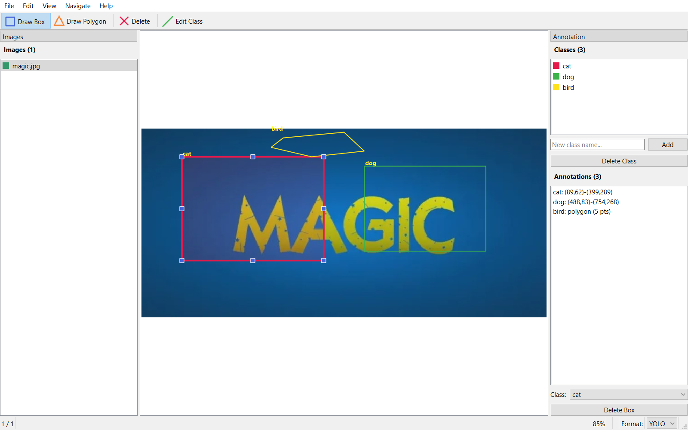

# AlchemyAnnotate - Lightweight Image Annotation Tool for Object Detection

AlchemyAnnotate is a free, open-source, desktop image annotation tool built with Python and PySide6. It provides a fast and intuitive interface for creating bounding box annotations used in training object detection models such as YOLO, Faster R-CNN, and SSD.

Export your annotations in **YOLO**, **Pascal VOC**, and **COCO** formats with a single click.



---

## Features

- **Bounding Box Annotation** - Draw, select, edit, and delete bounding boxes directly on images
- **Multi-Format Export** - Save annotations in YOLO, Pascal VOC (XML), and COCO (JSON) formats
- **Separate Annotation Folders** - Each format is stored in its own folder (`annotations_yolo/`, `annotations_voc/`, `annotations_coco/`) to prevent overwrites
- **Class Management** - Create, delete, and assign annotation classes through the UI with automatic color coding
- **Autosave** - Annotations are saved automatically after every change
- **Format Switching** - Switch between YOLO, VOC, and COCO at any time with automatic conversion of existing annotations
- **Existing Annotation Detection** - Automatically detects and loads previously saved annotations when opening a folder
- **Project Session File** - Remembers your last opened image, selected format, class list, and preferences across sessions
- **Image Navigation** - Browse images using sidebar, keyboard shortcuts, or arrow keys
- **Zoom and Pan** - Zoom with Ctrl+Scroll and pan with middle-click for precise annotation on large images
- **Sidebar Status** - Visual indicators show which images are labeled and which are still pending

---

## Supported Annotation Formats

| Format | Output Folder | File Type | Used By |
|---|---|---|---|
| **YOLO** | `annotations_yolo/` | `.txt` per image + `classes.txt` | YOLOv5, YOLOv8, Ultralytics |
| **Pascal VOC** | `annotations_voc/` | `.xml` per image | Faster R-CNN, SSD, Detectron |
| **COCO** | `annotations_coco/` | Single `annotations.json` | COCO API, Detectron2, MMDetection |

---

## Supported Image Formats

JPG, JPEG, PNG, BMP, TIFF, WEBP

---

## Installation

### Prerequisites

- Python 3.10 or higher
- pip

### Step 1: Clone the Repository

```bash
git clone https://github.com/yourusername/AlchemyAnnotate.git
cd AlchemyAnnotate
```

### Step 2: Create a Virtual Environment

Using pyenv (recommended):

```bash
pyenv install 3.10.6
pyenv local 3.10.6
python -m venv alchemyAnnotate_env
```

Or using standard venv:

```bash
python -m venv alchemyAnnotate_env
```

### Step 3: Activate the Environment

Linux / macOS:

```bash
source alchemyAnnotate_env/bin/activate
```

Windows (Git Bash):

```bash
source alchemyAnnotate_env/Scripts/activate
```

Windows (CMD):

```cmd
alchemyAnnotate_env\Scripts\activate
```

Windows (PowerShell):

```powershell
alchemyAnnotate_env\Scripts\Activate.ps1
```

### Step 4: Install Dependencies

```bash
pip install -r requirements.txt
```

Or install as a package:

```bash
pip install -e .
```

---

## How to Use

### Launch the Application

```bash
python run.py
```

Or run as a Python module:

```bash
python -m alchemyannotate
```

Or if installed as a package:

```bash
alchemyannotate
```

### Annotation Workflow

1. **Open a Folder** - Click `File > Open Folder` or press `Ctrl+O` to select a folder containing your images
2. **Create Classes** - In the right panel, type a class name (e.g., "car", "person") and click **Add**
3. **Select a Class** - Click on a class in the class list to make it active
4. **Draw Bounding Boxes** - Left-click and drag on the image to draw a box around an object
5. **Navigate Images** - Use the sidebar, or press `A` / `D` to go to the previous / next image
6. **Edit Boxes** - Click a box to select it, then change its class from the dropdown or press `Delete` to remove it
7. **Save** - Annotations autosave after every change. Press `Ctrl+S` to force a manual save
8. **Switch Format** - Use the format selector in the status bar to switch between YOLO, VOC, and COCO

### Keyboard Shortcuts

| Shortcut | Action |
|---|---|
| `Ctrl+O` | Open image folder |
| `Ctrl+S` | Save annotations |
| `Ctrl+Q` | Quit application |
| `Delete` | Delete selected bounding box |
| `A` or `Left Arrow` | Previous image |
| `D` or `Right Arrow` | Next image |
| `Ctrl+0` | Fit image to window |
| `Ctrl+Scroll` | Zoom in / out |
| `Middle-click drag` | Pan the image |

---

## Project File

When you open a folder, AlchemyAnnotate creates an `alchemyannotate_project.json` file inside it. This file stores:

- Selected annotation format
- Class list
- Last opened image
- Autosave preferences
- Recently used class

This allows you to resume your annotation session exactly where you left off.

---

## Project Structure

```
AlchemyAnnotate/
├── alchemyannotate/
│   ├── models/          # Data models (BoundingBox, ImageAnnotation, ProjectConfig)
│   ├── views/           # UI components (Canvas, Sidebar, Panels, Dialogs)
│   ├── controllers/     # Application logic (App, Canvas, Navigation controllers)
│   ├── services/        # IO, autosave, format conversion, image loading
│   └── utils/           # Constants, geometry helpers
├── tests/               # Unit tests for models, IO formats, and store
├── run.py               # Quick launcher
├── pyproject.toml       # Build configuration
└── requirements.txt     # Dependencies
```

---

## Running Tests

```bash
pip install -e ".[dev]"
pytest tests/ -v
```

---

## Dependencies

| Package | Version | Purpose |
|---|---|---|
| PySide6 | >= 6.6 | Qt6 GUI framework |

No other external dependencies. XML and JSON handling use Python standard library modules.

---

## Frequently Asked Questions

### What annotation format should I use?

- Use **YOLO** if you are training with Ultralytics YOLOv5, YOLOv8, or similar YOLO-based models
- Use **Pascal VOC** if you are training with Faster R-CNN, SSD, or frameworks that expect XML annotations
- Use **COCO** if you are using Detectron2, MMDetection, or the COCO evaluation API

### Can I switch formats after annotating?

Yes. AlchemyAnnotate will prompt you to export existing annotations to the new format when you switch.

### Where are my annotations saved?

Inside your image folder, in a subfolder named after the format:

- `annotations_yolo/` for YOLO format
- `annotations_voc/` for Pascal VOC format
- `annotations_coco/` for COCO format

### Does it support polygons or segmentation masks?

Not in v1. AlchemyAnnotate currently supports bounding box annotations only. Polygon and segmentation support may be added in future versions.

---

## License

This project is open source. See the LICENSE file for details.

---

## Contributing

Contributions are welcome. Please open an issue or submit a pull request on GitHub.
